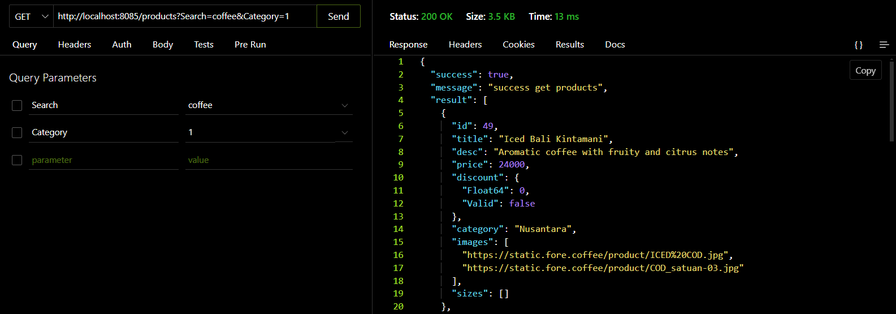
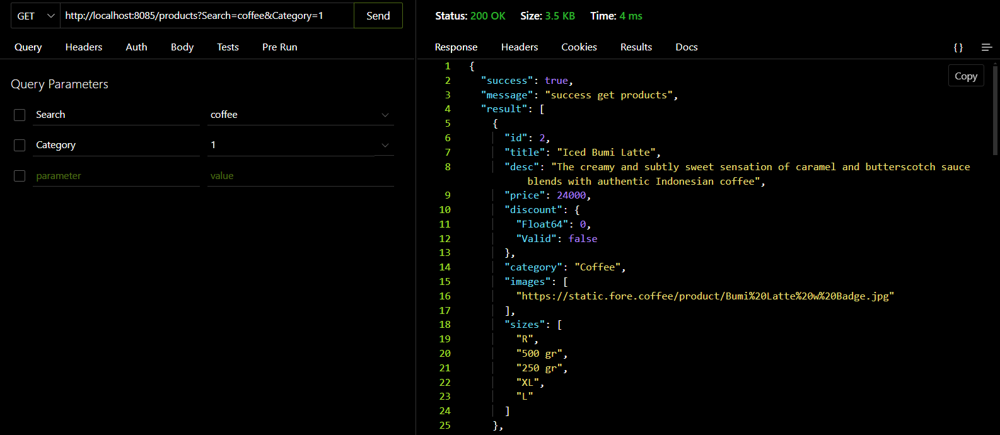

### Ambil data dari postgres

saat redis tidak menyimpan data products, maka data akan diambil dari postgres, yang memakan waktu 13 ms dalam sekali hit.
### Ambil data dari redis

setelah menggunakan redis, data akan disimpan di redis, sehingga data yang dibutuhkan bisa langsung diambil di redis dan hanya memakan waktu 3 ms. ini jauh sangat meringankan server.